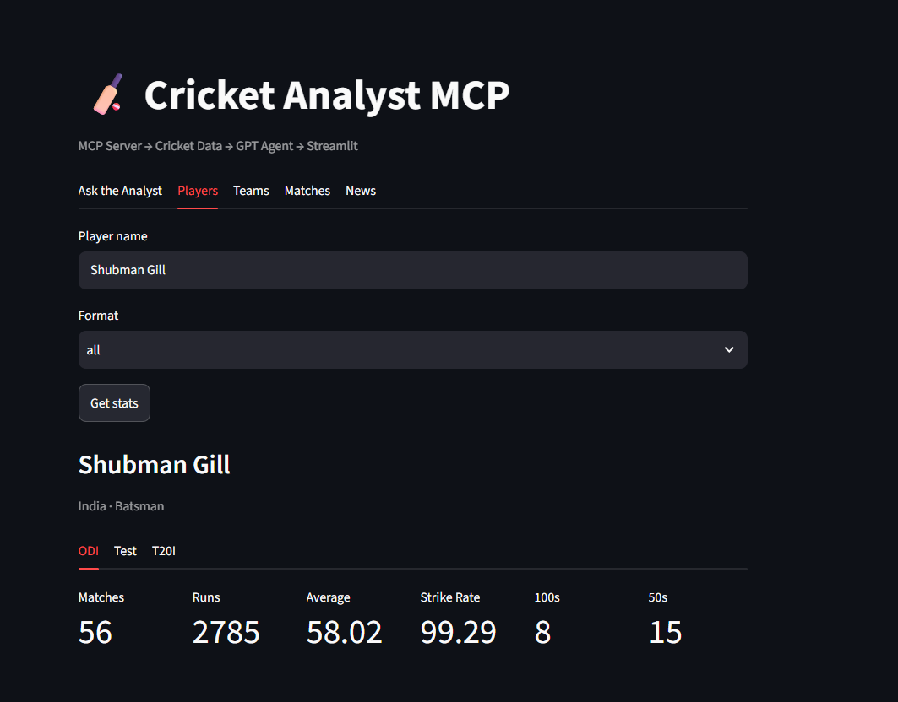
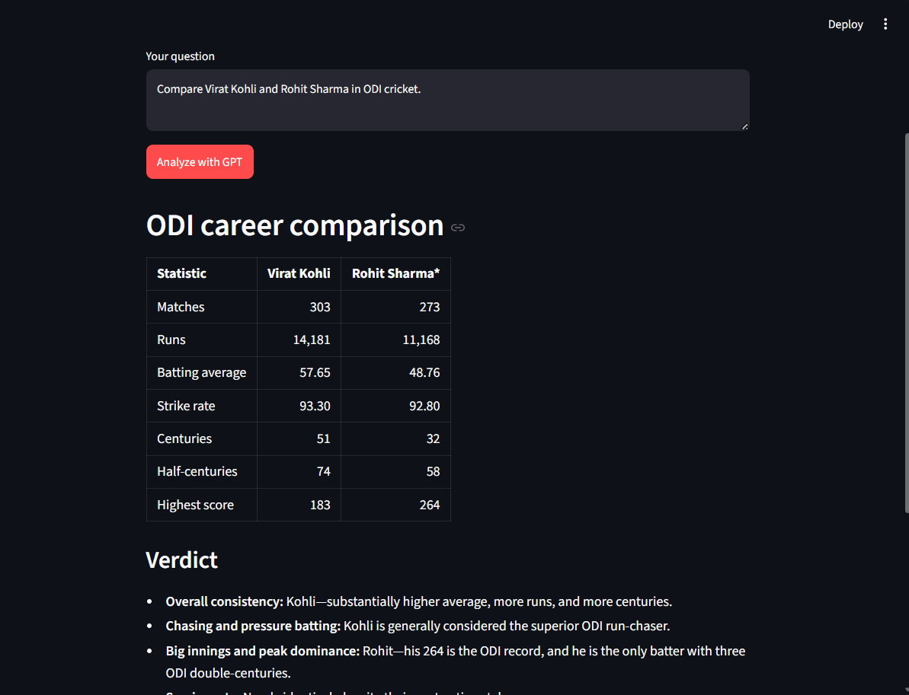

# 🏏 Cricket Analytics MCP

An AI-powered Cricket Analytics Agent built with **Model Context
Protocol (MCP)**, **OpenAI**, **Python**, and **Streamlit**.

The project allows users to explore cricket statistics and ask
natural-language questions about players, teams, matches, and player
comparisons through an AI-powered interface.

## ✨ Features

-   🏏 Cricket player statistics
-   📊 Player performance analysis
-   ⚔️ Compare two cricket players
-   🏆 Team statistics and analysis
-   📅 Match results and recent matches
-   📰 Cricket news search
-   🤖 OpenAI-powered cricket analyst
-   🔌 MCP server for exposing cricket tools
-   🎨 Interactive Streamlit web interface
-   🔐 Environment-based API key configuration

## 🏗️ Architecture

``` text
                    ┌─────────────────────┐
                    │    Streamlit UI     │
                    │  streamlit_app.py   │
                    └──────────┬──────────┘
                               │
                               ▼
                    ┌─────────────────────┐
                    │    OpenAI Agent      │
                    │   agent_openai.py    │
                    └──────────┬──────────┘
                               │
                               ▼
                    ┌─────────────────────┐
                    │     MCP Server      │
                    │      server.py       │
                    └──────────┬──────────┘
                               │
                               ▼
                    ┌─────────────────────┐
                    │    Data Provider    │
                    │  data_provider.py   │
                    └─────────────────────┘
```

## 📁 Project Structure

``` text
cricket-analytics-mcp/
│
├── agent_openai.py       # OpenAI-powered cricket agent
├── data_provider.py      # Cricket data and statistics provider
├── server.py             # MCP server and cricket tools
├── streamlit_app.py      # Streamlit frontend
│
├── screenshots/          # Application screenshots
│   ├── player-stats.png
│   ├── player-comparison.png
│   └── dashboard.png
│
├── .env                  # API keys and configuration (not committed)
├── .gitignore            # Git ignored files
├── requirements.txt      # Python dependencies
└── README.md             # Project documentation
```

## 🛠️ Tech Stack

-   **Python**
-   **OpenAI API**
-   **Model Context Protocol (MCP)**
-   **Streamlit**
-   **python-dotenv**
-   Cricket statistics/data sources

## 🔧 MCP Tools

The MCP server can expose cricket-focused tools such as:

``` text
get_player_stats()
get_team_stats()
get_match_results()
get_player_comparison()
get_recent_matches()
search_cricket_news()
```

These tools allow the AI agent to retrieve structured cricket
information and use it to answer user questions.

## 💬 Example Queries

``` text
Show me Virat Kohli's ODI statistics.

Compare Virat Kohli and Rohit Sharma in ODI cricket.

Show me the recent matches of India.

Give me the Test statistics of Virat Kohli.

Compare the performance of two cricket players.

Show recent cricket news.
```

## ⚙️ Installation

### 1. Clone the repository

``` bash
git clone https://github.com/manasranjanmeher99/Cricket-Analytics-MCP.git
cd Cricket-Analytics-MCP
```

### 2. Create a virtual environment

Windows:

``` bash
python -m venv .venv
.venv\Scripts\activate
```

### 3. Install dependencies

``` bash
pip install -r requirements.txt
```

### 4. Configure environment variables

Create a `.env` file in the project root:

``` env
OPENAI_API_KEY=your_openai_api_key
OPENAI_MODEL=gpt-5.6
CRICAPI_KEY= xxxxxxx
```

**Never commit your `.env` file to GitHub.**

## ▶️ Running the Application

### Start the Streamlit application

``` bash
streamlit run streamlit_app.py
```

Then open the local Streamlit URL shown in your terminal.

### Start the MCP server

If your project is configured to run the MCP server separately:

``` bash
python server.py
```

Follow the MCP configuration used by your client/agent setup.

## 🧪 Project Workflow

``` text
User Question
      ↓
Streamlit Interface
      ↓
OpenAI Agent
      ↓
MCP Tool Selection
      ↓
MCP Server
      ↓
Cricket Data Provider
      ↓
Structured Cricket Data
      ↓
OpenAI Analysis
      ↓
Streamlit Response
```

## 🔐 Environment Variables

  Variable           Description
  ------------------ --------------------------------
  `OPENAI_API_KEY`   OpenAI API key
  `OPENAI_MODEL`     OpenAI model used by the agent
  `CRICAPI_KEY`      Cric API key

Example:

``` env
OPENAI_API_KEY=sk-xxxxxxxx
OPENAI_MODEL=gpt-5.6
CRICAPI_KEY= xxxxxxx
```

## 📸 Screenshots

Add screenshots of the application to the `screenshots/` directory.

Recommended screenshots:

-   Player statistics
-   Player comparison
-   Cricket analytics dashboard

Then reference them in this README:

``` markdown



```

## 🚀 Future Improvements

-   [ ] Live cricket scores
-   [ ] Live match commentary
-   [ ] Player rankings
-   [ ] Advanced player comparison charts
-   [ ] Team performance analytics
-   [ ] Historical match analysis
-   [ ] Cricket news aggregation
-   [ ] More MCP tools
-   [ ] Improved dashboard visualizations
-   [ ] Deployment to Streamlit Community Cloud

## 🎯 Use Cases

This project can be used for:

-   Cricket statistics exploration
-   Player performance analysis
-   AI-powered cricket research
-   Cricket data visualization
-   MCP learning and experimentation
-   Agentic AI portfolio development

## 👨‍💻 Author

**Manas Ranjan Meher**

